# CSE 527 Final Term Project: EDM2 Generative Models Analysis

This repository contains the final term project for **CSE 527: Computer Vision**. The project focuses on analyzing and implementing **EDM2 (Elucidating the Design Space of Diffusion-Based Generative Models)** with a focus on noise scheduling and conditional generation strategies using the **CelebA** dataset.

## 📄 Abstract

Diffusion models have revolutionized generative AI. This project explores the **EDM2** framework, specifically investigating how different **noise schedules** (Linear, Cosine, Logarithmic, Quadratic) impact generation quality. Furthermore, we implement conditional generation to control facial attributes (e.g., "Smiling", "Eyeglasses") and facial landmarks.

```mermaid
graph LR
    %% Styles
    classDef dataset fill:#e1f5fe,stroke:#01579b,stroke-width:2px,color:#01579b;
    classDef process fill:#f3e5f5,stroke:#4a148c,stroke-width:2px,color:#4a148c;
    classDef model fill:#e8f5e9,stroke:#1b5e20,stroke-width:2px,color:#1b5e20;
    classDef schedule fill:#fff3e0,stroke:#e65100,stroke-width:2px,color:#e65100;
    classDef artifact fill:#fff8e1,stroke:#ff6f00,stroke-width:2px,stroke-dasharray: 5 5,color:#ff6f00;

    subgraph Data ["DATA PREPARATION"]
        CelebA[("CelebA Dataset")]:::dataset
        Preproc["Resize (64x64) & Norm"]:::process
        CondData["Attributes / Landmarks"]:::dataset
    end

    subgraph Schedule ["NOISE SCHEDULE STRATEGY"]
        NS{"Select Schedule"}:::schedule
        Linear["Linear"]:::schedule
        Cosine["Cosine"]:::schedule
        Log["Logarithmic"]:::schedule
        Quad["Quadratic"]:::schedule
    end

    subgraph Training ["TRAINING LOOP (EDM2)"]
        SampleT["Sample Time t ~ U[0,1]"]:::process
        CalcSigma["Calculate σ(t)"]:::process
        Noise["Sample Noise n ~ N(0, I)"]:::process
        Corrupt["Corrupt: x + n*σ"]:::process
        UNet[/"EDM2 Precond U-Net"/]:::model
        Loss["Loss: Weight * ||D(x+n,σ) - x||²"]:::process
        Update["Backprop & Optimize"]:::process
    end

    subgraph Inference ["INFERENCE & EVALUATION"]
        RandNoise["Random Gaussian Noise"]:::dataset
        Sampler["Iterative Denoising<br/>(Euler/Heun)"]:::process
        GenImg["Generated Images"]:::artifact
        Eval["FID Score Evaluation"]:::process
    end

    %% Data Flow
    CelebA --> Preproc
    CondData -.-> UNet
    Preproc --> Corrupt
    Preproc --> Loss

    %% Schedule Flow
    NS --> Linear
    NS --> Cosine
    NS --> Log
    NS --> Quad
    Linear & Cosine & Log & Quad --> CalcSigma
    SampleT --> CalcSigma
    CalcSigma --> Corrupt
    CalcSigma --> UNet
    CalcSigma --> Sampler

    %% Training Flow
    Noise --> Corrupt
    Corrupt --> UNet
    UNet --> Loss
    Loss --> Update

    %% Inference Flow
    RandNoise --> Sampler
    Sampler --> GenImg
    GenImg --> Eval

```



## 🚀 Key Features

*   **Noise Schedule Analysis**: Comprehensive comparison of Linear, Cosine, Logarithmic, and Quadratic noise schedules in the EDM2 training loop.
*   **Unconditional Generation**: Baseline generation of CelebA faces (64x64).
*   **Conditional Generation (40 Attributes)**: Controlled synthesis using the standard 40 CelebA binary attributes.
*   **Conditional Generation (Landmarks)**: Generation conditioned on facial landmarks for geometric control.
*   **FID Analysis**: Quantitative evaluation of generated image quality across different schedules.

## 📂 Project Structure

The codebase is organized into modular components for clarity and reproducibility:

```text
CSE527_Final_Project/
├── README.md               # Project documentation
├── report/                 # Detailed Project Report
│   └── CV_finalterm_project_report.pdf
├── plots/                  # Generated figures and visualizations
│   ├── all_schedules_per_row_sigma_32step.png
│   └── ...
└── src/                    # Source Code
    ├── unconditional/      # Unconditional EDM2 experiments
    │   ├── cosine_edm2_celeba_uc.ipynb
    │   ├── linear_edm2_celeba_uc.ipynb
    │   └── ...
    ├── conditional/        # Conditional EDM2 experiments
    │   ├── attributes_40/  # Attribute-conditioned models
    │   └── landmarks/      # Landmark-conditioned models
    └── utils/              # Plotting and logging utilities
```

## 🛠️ Usage

### Prerequisites
*   Python 3.8+
*   PyTorch
*   Required libraries: `torch`, `torchvision`, `numpy`, `matplotlib`, `scipy`

### Running the Notebooks
1.  **Unconditional Generation**: Navigate to `src/unconditional/` and run the desired schedule notebook (e.g., `cosine_edm2_celeba_uc.ipynb`) to train or sample from the model.
2.  **Conditional Generation**:
    *   For attributes: `src/conditional/attributes_40/cond_edm2_karrasrho_40attr.ipynb`
    *   For landmarks: `src/conditional/landmarks/karras_rho_cond_landmark_training.ipynb`

## 📊 Results & Observations

### Noise Schedules
We observed distinct differences in convergence and image quality based on the noise schedule used.
*   **Cosine Schedule**: showed stable convergence.
*   **Linear Schedule**: was used as a baseline.
*   *(Refer to `plots/` for visual comparisons of sigma steps)*

### Conditional Control
The models successfully learned to disentangle attributes, allowing for specific manipulations such as adding glasses or changing facial expressions while maintaining identity consistency.

## 👥 Credits
**Course**: CSE 527 Computer Vision (Stony Brook University)
**Project**: Final Term Project - EDM2 Analysis
